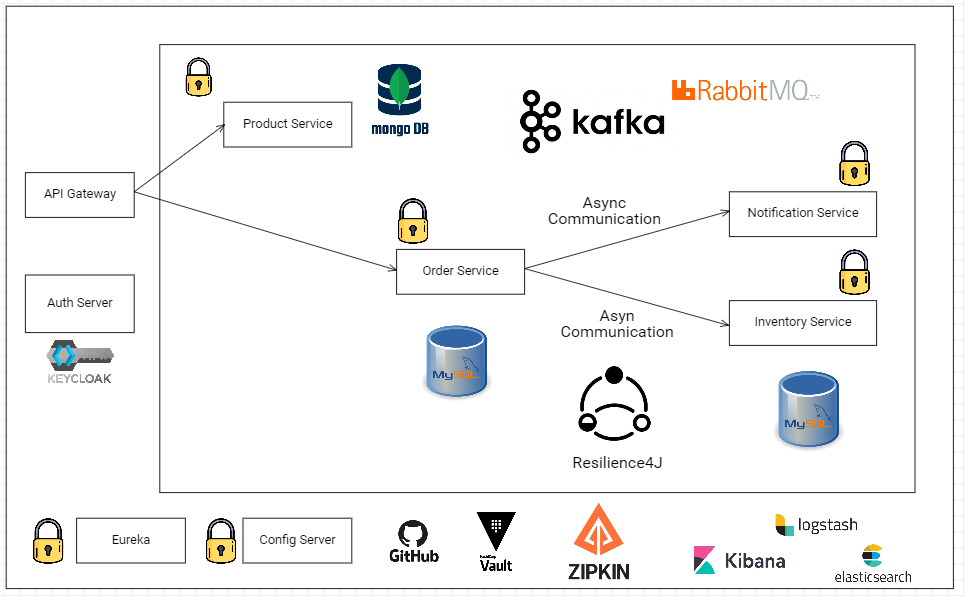

# 🍃 Spring Boot microservices

This is a demo of microservice architecture based on a [Programming Techie](https://www.youtube.com/watch?v=D_XxZU72yMw&list=PLSVW22jAG8pBnhAdq9S8BpLnZ0_jVBj0c) tutorial. This is a basic ecommerce application that deals with the following concepts:

- Service Discovery,
- Centralized Configuration,
- Distributed Tracing,
- Event Driven Architecture,
- Centralized Logging,
- Circuit Breaker,
- Secure Microservice Using KEYCLOAK

## List of dependencies

- Spring WEB
- Spring WebFlux
- Spring Data JPA,
- Spring Data MongoDB,
- Spring Security,
- Spring OAuth2 resource Server,
- Spring Actuator,
- Resilience4J,
- PostgreSQL Driver,
- Webflux
- Netflix Eureka Client,
- Netflix Eureka Server,
- Lombok

## Architecture diagram of project


## Getting Started

### Keycloak Setup

1. Download the [Keycloak](https://www.keycloak.org/downloads) server and unzip it in the directory of your choice.
2. Once the file has been unzipped, go to your server directory and run the following command:
    ```bash
    bin/kc.bat start-dev --http-port 8180
    ```
   By default, the port used by Keycloak is 8080 you can omit the command ```--http-port 8180```
3. When creating your "Demo" realm, you can import data directly using the [realm-export](https://github.com/Hichem-Belhadj/ms-project/tree/main/doc/keycloak/realm-export.json) json file available in the resources package.
4. After launching your application, you can retrieve the client's ```acces_token``` with any protected controller endpoint:
   Select oauth2 in the ```Authorization``` tab and enter the parameters below for the ```Configure New Token``` section:

   | Key                | Value              |
   |--------------------|----------------    |
   | **Token Name**     | Choose a name      |
   | **Grant Type**     | Client Credentials |
   | **Client Secret**  | Get from Keycloak  |
   | **Scope**          | openid             |

5. Press the ```aGet New Access Token``` button