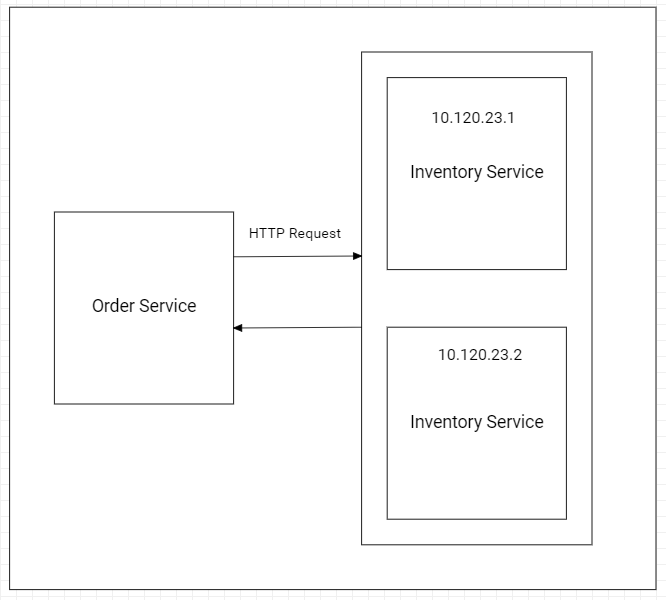
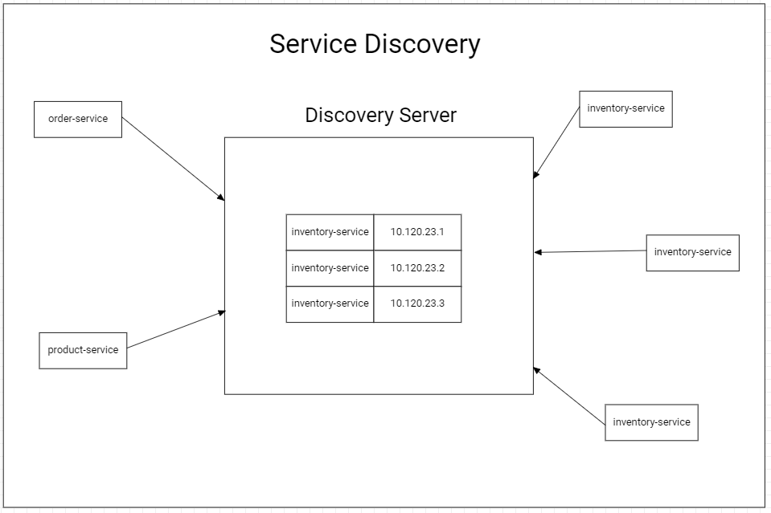
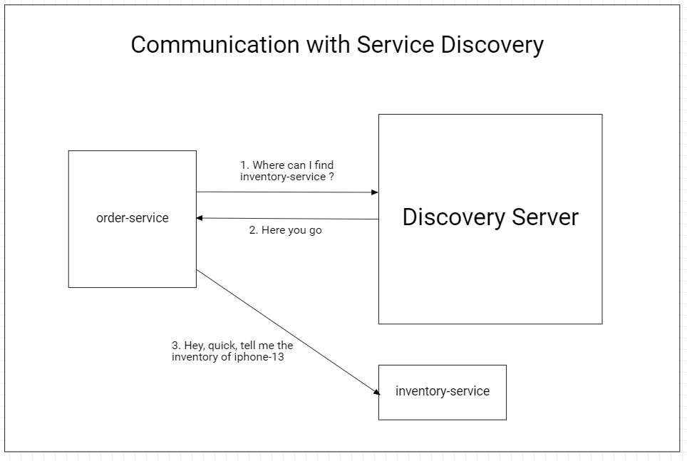
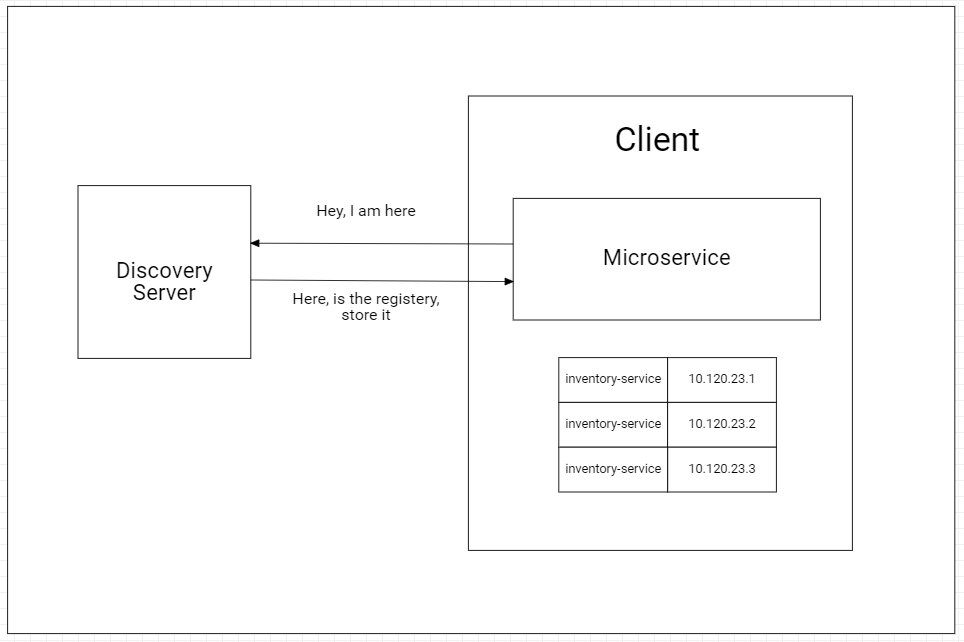

# Discovery Server

## Project Need: Utilizing Multiple Instances of the Same Microservice

In this project, we seek to implement an architecture that leverages the use of multiple instances of a specific microservice. The primary objective is to harness several essential advantages that will significantly enhance the performance, reliability, and scalability of our application.

### Advantages

| Advantages                    | Description                                                                                                      |
|------------------------------|------------------------------------------------------------------------------------------------------------------|
| **High Availability**         | Employing multiple instances of the microservice enables load distribution, reducing single points of failure and ensuring high availability of the application. |
| **Horizontal Scalability**   | By adding instances as needed, the capacity of the microservice can be increased linearly, efficiently addressing growing user numbers and workloads. |
| **Load Balancing**           | Requests can be evenly distributed among instances, eliminating potential bottlenecks and ensuring a responsive user experience. |
| **Error Isolation**          | If one instance encounters an error or failure, other instances can continue to operate normally, providing better fault tolerance and increased resilience. |
| **Independent Scaling**      | Each instance of the microservice can be updated, deployed, or modified independently, facilitating continuous development and iterative improvements of the service. |
| **Resource Optimization**    | Efficient allocation of system resources across multiple instances helps optimize hardware and software resource utilization, improving overall system performance. |

By embracing this approach of utilizing multiple instances of the same microservice, our project aims to deliver a robust, scalable, and resilient solution that meets the needs of our users while ensuring a smooth and high-quality user experience.

This project utilizes Eureka Discovery Server to simplify the communication between multiple microservices in our distributed system. Eureka serves as a powerful service registry, allowing microservices to register themselves and enabling dynamic discovery of other services, removing the need for hardcoded service endpoints.

### Eureka Discovery Server

The Eureka Discovery Server plays a crucial role in facilitating communication among microservices. Here's how it works:

1. **Service Registration**: Each microservice registers itself with the Eureka server during startup. This registration process includes information about the service's network location, making it visible to other microservices.

2. **Service Discovery**: When a microservice needs to communicate with another service, it queries the Eureka server to obtain the network location of the desired service. This enables a dynamic and adaptive approach to service discovery.

3. **Heartbeat Mechanism**: Eureka employs a heartbeat mechanism to monitor the health of registered microservices. If a service fails or becomes unavailable, it stops sending heartbeats, and the Eureka server removes it from the registry. This ensures that microservices only interact with healthy and available instances.

By leveraging Eureka Discovery Server, our project achieves improved flexibility, scalability, and reliability within our distributed system.

The Eureka Discovery Server plays a crucial role in facilitating communication among microservices. Here's how it works:

1. **Service Registration**: Each microservice registers itself with the Eureka server during startup. This registration process includes information about the service's network location, making it visible to other microservices.

2. **Service Discovery**: When a microservice needs to communicate with another service, it queries the Eureka server to obtain the network location of the desired service. This enables a dynamic and adaptive approach to service discovery.

3. **Heartbeat Mechanism**: Eureka employs a heartbeat mechanism to monitor the health of registered microservices. If a service fails or becomes unavailable, it stops sending heartbeats, and the Eureka server removes it from the registry. This ensures that microservices only interact with healthy and available instances.

### Caching Service Addresses

To handle potential scenarios where the Eureka Discovery Server experiences temporary outages, our clients implement a caching mechanism to store the addresses of registered services. This caching approach ensures that even if the Eureka server is temporarily unavailable, our clients can continue to communicate with other services using the locally cached addresses. Periodically, the clients will check if the Eureka server is back online to refresh the cache and ensure up-to-date service discovery.

By leveraging Eureka Discovery Server with a caching strategy, our project achieves improved flexibility, scalability, and reliability within our distributed system.
